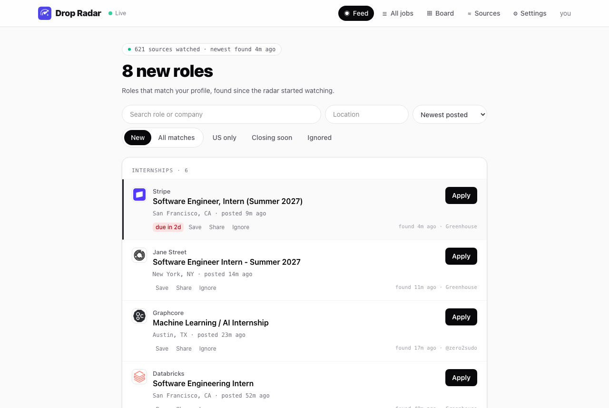
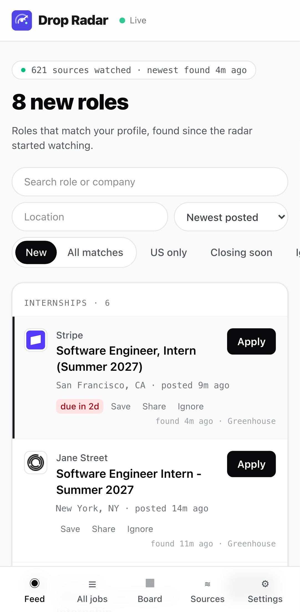
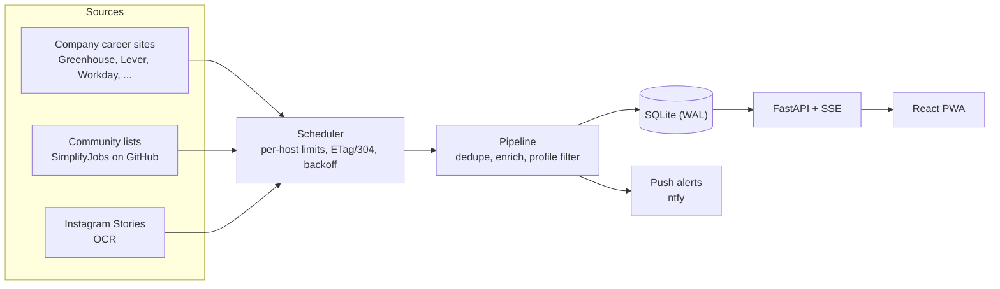

# Drop Radar

**An always-on radar for internship and new-grad postings.** It watches about 600 company career sites,
community job lists and an Instagram account's Stories, keeps only what matches your profile, and tells you
within minutes: a live web app and a phone push, instead of refreshing a dozen tabs.

<p>
  
  
</p>

<sub>Screenshots use invented sample postings.</sub>

## Why

Early-career roles open and fill quickly, and the announcement is scattered: some appear first on the
employer's own applicant-tracking system, some on community lists that lag by hours, and some only in an
Instagram Story that disappears after a day. I started this to catch the Stories of
[@zero2sudo](https://www.instagram.com/zero2sudo/) (a career-opportunity account) without opening Instagram
every hour. It grew into a general radar that polls the employers' boards directly, because those publish
before anyone reposts them.

## What it does

- **Polls ~600 career sources politely.** Greenhouse, Lever, Ashby, SmartRecruiters, Workday, Workable,
  Oracle HCM, Eightfold, Avature, Amazon, Google, Apple and sitemap-based sites, plus the SimplifyJobs
  GitHub lists and Instagram Stories (OCR). Top-tier companies are checked every 2 minutes, others every 5
  or 15.
- **Filters to you.** A profile names a *track* (software engineer, investment banking, ...) and a *level*
  (intern, new grad, ...); a posting must have both, in a location you accept, for the right season.
- **One feed, two clocks.** Each posting shows when the employer posted it and when the radar found it, newest
  first, with search, location and US-only filters, company logos and a prestige sort.
- **Live drops.** New postings stream into the open page (server-sent events) and can push to a phone
  through [ntfy](https://ntfy.sh).
- **An application board.** Save a posting, move it through applied, interview, offer or rejected, keep notes.
- **Several users, one box.** Each person has their own watchlist, profile, statuses and push topic; a source
  both watch is polled once.

## How it works



1. **Sources** (`radar/sources/`) are plugins, one file per kind, behind a small `Source` protocol:
   `fetch(ctx) -> list[Item]`. They raise typed errors (auth, blocked, transient, schema) so the scheduler
   knows how to back off.
2. **Scheduler** (`radar/scheduler.py`) runs each source on its own timer, with a per-host rate limit and a
   global request cap, and saves a cursor or ETag only after the items are stored.
3. **Pipeline** (`radar/pipeline/`) canonicalizes URLs and company names, merges the same job seen in several
   places into one opportunity, extracts season, track and location from the title (an LLM is optional and
   budgeted), and decides who it matches.
4. **Store** (`radar/store/`) is one SQLite file: opportunities, per-source sightings, source health, sent
   alerts, and each user's status and notes.
5. **API and web** (`radar/api/`, `web/`) serve the feed, board, settings and live stream to a React PWA.

## Design decisions worth a look

- **Seed, then diff.** A source's first poll stores everything already open as *backfill*, so the feed is full
  on day one, but nothing in it can alert. Only postings that appear after that are drops. A posting dated more
  than a week before it was seen (a title edit, a widened search, a late list row) is treated as backfill too.
- **Cheap, polite polling.** Conditional requests (ETag / 304) mean an unchanged board costs no download.
  A per-host rate limit and a global request cap keep it gentle, every request carries an honest User-Agent,
  and a source only touches documented public APIs or paths `robots.txt` allows.
- **Claim before send.** An alert row is claimed in the database before the push goes out, and retries only
  resend claimed-but-unsent rows, so a crash or a concurrent sweep cannot double-push.
- **One rule for feed and phone.** What shows in a user's feed and what alerts their phone come from the same
  predicate (`radar.alerts.visible_to`), so they cannot disagree. A user only ever sees opportunities their own
  sources found.
- **IDs are permanent.** Opportunity IDs, statuses and notes survive re-imports and re-deduplication.
  Backups use SQLite's online backup API, so they are safe while the service is writing.
- **A residential relay for Instagram.** Instagram rate-limits cloud IPs, so a script on a home Mac
  (`deploy/instagram-relay.py`, run by launchd) fetches the Stories and posts them to the server over SSH; the
  server OCRs and processes them like any other source.

## Tech stack

Python 3.12+, `asyncio`, `httpx`, FastAPI, Uvicorn, SQLite (WAL), Tesseract OCR, optional Claude for
extraction. Web: React, TypeScript, Vite, Tailwind, TanStack Query, a service worker (installable PWA),
TypeScript types generated from the API's OpenAPI schema. Deployed with systemd and Caddy on a free-tier VM.

## Run it locally

```bash
python3 -m venv .venv && source .venv/bin/activate
pip install -r requirements.txt            # OCR needs Tesseract: brew install tesseract / apt install tesseract-ocr
(cd web && npm ci && npm run build)        # the app is served by the API at /

# The user id must match one in config/users.yaml (the shipped file has `kevin` and `friend`).
export API_TOKENS="kevin:$(python -c 'import secrets; print(secrets.token_urlsafe(32))')"
python -m radar serve                      # http://127.0.0.1:8000 -- sign in with that token
```

The shipped watchlist polls about 600 sources on the first sweep (politely, but it is a lot). Trim
`config/watchlist.yaml` to a handful of companies for a first try. `python -m radar.sources.discover --check`
verifies that a board slug is real before you add it.

| Variable | Purpose |
|---|---|
| `API_TOKENS` | `user:secret,...` (secrets at least 20 characters); required to sign in |
| `RADAR_CONFIG_DIR`, `RADAR_DB_PATH` | where config and the database live (defaults `config/`, `data/radar.db`) |
| `NTFY_TOPIC`, `NTFY_TOPIC_<USER>` | phone push topics, one per user (`NTFY_SERVER`, `NTFY_TOKEN` for a private server) |
| `GH_TOKEN` | raises GitHub's rate limit for the community lists (a token with no scopes is enough) |
| `IG_SESSIONID` | Instagram Stories, via a secondary account's session cookie |
| `ANTHROPIC_API_KEY` | optional LLM extraction; without it the radar uses regex-only enrichment |
| `HEARTBEAT_URL` | optional dead-man-switch URL pinged by the scheduler |

Other commands: `python -m radar backup`, `python -m radar stats` (drop latency per source),
`python -m radar openapi`. The front end alone: `cd web && npm run dev`.

## Tests

```bash
python -m unittest discover -s tests       # ~400 offline tests, no network
python -m pyflakes ./*.py radar tests
(cd web && npm run e2e)                    # Playwright against the built app, desktop and phone
```

GitHub Actions runs the Python suite and lint on 3.12 and 3.14 for every push. Live probes are marked and skipped
by default.

## Deploying

`deploy/` has a systemd unit, a nightly-backup timer, a Caddy config for HTTPS, and
[`deploy/README.md`](deploy/README.md), a step-by-step setup that also records what the first real deploy on an
Oracle Cloud Always Free VM (1 GB RAM) taught me.

## Repository layout

```
radar/
  sources/     one plugin per source kind (ats.py holds the shared seed-then-diff logic)
  pipeline/    normalize, dedupe, enrich, filter
  store/       SQLite schema, migrations, repository API
  alerts/      ntfy channel, claim-before-send dispatcher, the shared visibility rule
  api/         FastAPI app, runtime (hot-reloaded config), SSE events
  scheduler.py, config.py, logos.py, backup.py, stats.py
web/           React PWA and Playwright checks
config/        users, watchlists and profiles (YAML)
deploy/        systemd units, Caddyfile, the Instagram relay
tests/         offline unit and integration tests
docs/          specs/ (plan and decisions per milestone), openapi.json, images/
```

The repository root also holds the first version of the project, an hourly GitHub Actions job
(`.github/workflows/hourly.yml`, the small `opportunity_monitor.py` shims, and the tracker files it
generates). Its guide is [`docs/legacy-hourly-monitor.md`](docs/legacy-hourly-monitor.md). `CLAUDE.md` /
`AGENTS.md` are working notes for AI coding assistants.

## Limits and responsible use

- **Speed is bounded by polling**: 2, 5 or 15 minutes by tier, plus rate limits and request queuing. It cannot
  beat an insider post, only match it. Some boards publish only a date, so "posted X ago" is approximate for them.
- **Some employers are not covered.** Sites that forbid automated access (for example Meta, TikTok and
  iCIMS-hosted boards) are left out rather than scraped; community lists cover them, usually hours late.
- **Instagram is a terms-of-service risk.** Automated access is against Instagram's terms, so use a secondary
  account, keep it to a handful of accounts (the config enforces a cap of 5) or remove the `instagram:`
  entry; everything else works without it.
- **It finds postings; it does not apply for you.** Eligibility and applications stay with a human.

## Project history

The plan and what each milestone decided are in [`docs/specs/`](docs/specs/) (start with
[`00-overview.md`](docs/specs/00-overview.md) and [`PROGRESS.md`](docs/specs/PROGRESS.md)). Next up: an hourly
email digest, push only for a priority list, and a UI pass.
