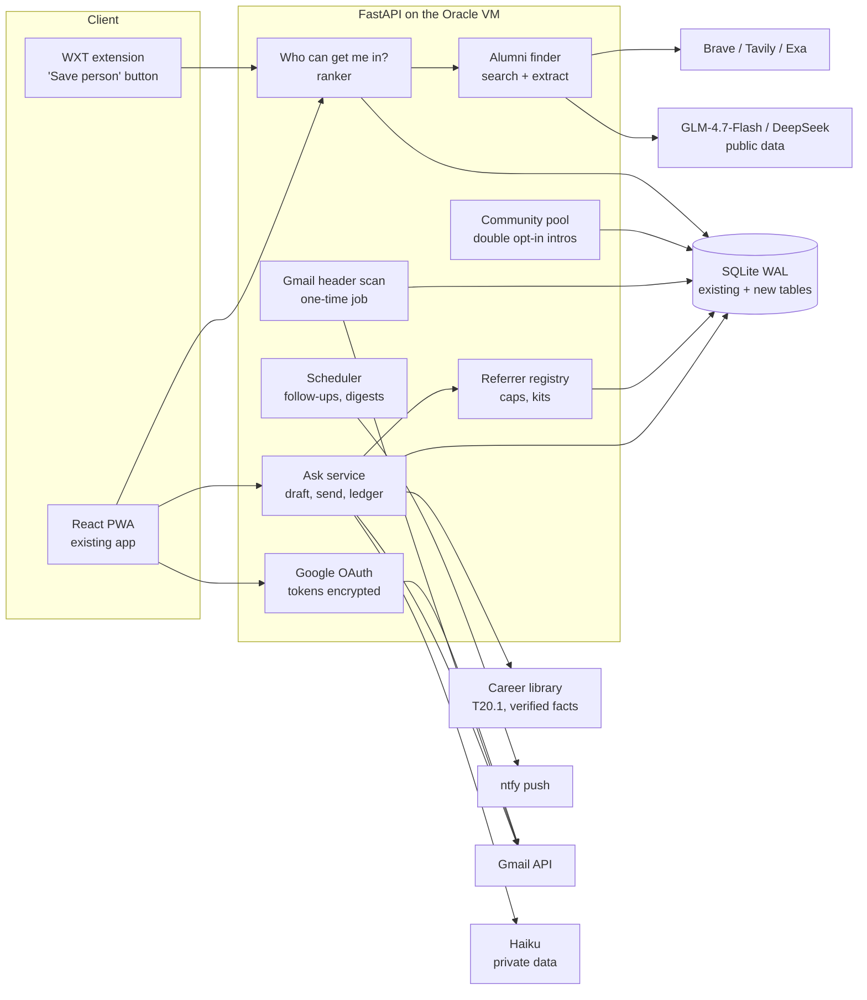

# Drop Radar referral layer: free stack and system design

Brainstorm research, 2026-10-05, for a six-week cseed Buildspace project (Oct 15 – Nov 17). Nothing here
was built, connected or deployed. Prices and free tiers come from vendor pages and third-party
roundups found by web search on this date; confirm on the vendor page before relying on any of them.

**The bet:** finding people is commodity (Happenstance, Jobright). The project's own part is the
**ask layer**: drafting an honest ask, rationing how often any one alum is asked across all
users, a referral kit, follow-ups, and outcomes measured as interviews per hour of effort.

## Answer in one paragraph

No open-source repo does this whole job, Chinese or otherwise. The useful pieces are small: one MIT
warm-intro repo whose scoring and funnel ideas are worth reading, an MIT browser-extension framework, a
free-email-domain list, and Inbox Zero as a reference for Gmail OAuth. The real savings come from
**APIs with free allowances** (Brave, Tavily, Firecrawl, Exa) and **cheap or free models, many of them
Chinese** (GLM-4.7-Flash free, DeepSeek V4 Flash, Qwen), used only on *public* data. Private data (email
headers, career facts, drafts) stays on Haiku. Build on the existing Drop Radar stack (FastAPI, SQLite,
React PWA, ntfy, Career library). Pilot cost: **under about $20 for 30 students.**

## What to take, and what to leave

### Repos

| Repo | Licence | Use | Verdict |
|---|---|---|---|
| [draftboardco/lean-intros](https://github.com/draftboardco/lean-intros) | MIT | Python + SQLite warm-intro pathfinder: "the bare-bones version of CTD/Swarm/Happenstance." Has a scoring formula for work and school overlap, plus an intro-request funnel (requested, in progress, intro made, passed) | **Read and borrow ideas.** Five stars, built in a weekend as a lead magnet for Draftboard; don't depend on it |
| [elie222/inbox-zero](https://github.com/elie222/inbox-zero) | MIT, about 12k stars | Open-source AI email assistant (Next.js) | **Reference only.** Read how it handles Gmail OAuth, scopes and drafting; don't embed it |
| [wxt-dev/wxt](https://github.com/wxt-dev/wxt) | MIT | Browser-extension framework (Manifest V3, cross-browser, React) | **Use** for the "Save person" extension. Plasmo is considered to be in maintenance mode |
| [kikobeats/free-email-domains](https://github.com/kikobeats/free-email-domains) | Check the licence | List of free and disposable email domains | **Use** to drop gmail.com, outlook.com and similar before mapping domains to companies |
| [moj-analytical-services/splink](https://github.com/moj-analytical-services/splink) | MIT | Probabilistic record linkage (entity resolution) | **Skip for the pilot.** Merging on exact email and profile URL is enough at 30 users |
| [web-infra-dev/midscene](https://github.com/web-infra-dev/midscene) (ByteDance) | MIT, about 15k stars | Vision-driven browser automation, with a Chrome extension | **Skip.** It automates browsing, which is the account-ban pattern this design avoids |
| joeyism/linkedin_scraper | GPL-3.0 | Playwright scraper that logs in with a saved session | **Avoid.** It's logged-in automation, and GPL would bind the whole app |
| cullenwatson/StaffSpy | WTFPL | Company rosters through LinkedIn's internal (Voyager) API | **Avoid.** Uses a private API, and open issues report breakage |
| tomquirk/linkedin-api | — | Unofficial Voyager client | **Avoid.** No release since November 2024 |
| Dify, FastGPT, Coze Studio, AgentScope | Various | Agent platforms (Chinese origin) | **Skip.** Too heavy for the 1 GB VM and not needed for one loop (same conclusion as the T20 research) |
| MediaCrawler | Non-commercial | Crawler for Chinese social platforms | Irrelevant (no LinkedIn) |

### Search APIs (for finding alumni from public profile snippets)

| API | Free allowance | Paid | Notes |
|---|---|---|---|
| Brave Search | $5 credit a month (about 1,000 queries) | $5 per 1k | Its own index; the cleanest terms. **Default** |
| Tavily | 1,000 credits a month | Paid plans from about $30 a month | Good **second** option |
| Firecrawl search | 1,000 credits a month | From $16 a month | Already used in this repo's research |
| Exa | Sources disagree on a free tier | $7 per 1k | Has a **people search** over about 1B profiles. Best quality, but carries platform risk |
| Perplexity Search | — | $1 per 1k | Cheap fallback |
| Serper, SerpApi | — | $0.30–1 per 1k | **Avoid.** They resell Google results; Google sued SerpApi in December 2025 |
| Bocha (Chinese) | — | — | **Skip.** Built for the Chinese web; weak on US LinkedIn profiles |
| Happenstance API | Credit-based (2 credits per search); price not published | — | **Fallback** if your own search is still weak after week 2 |

My 2026-10-05 test of `site:linkedin.com/in "Palantir" "University of Washington"` returned 10 real
profiles with headline, company, school and city. **About half had already left Palantir**, so an LLM
step that labels current vs. former employees is required.

### Models: route by data sensitivity

| Data | Model | Why |
|---|---|---|
| **Private:** email headers, career facts, drafts, replies | Claude Haiku 4.5 ($1 / $5 per M tokens) | Already validated in this repo's bake-off. The Anthropic API doesn't train on API data by default |
| **Public:** search snippets, company-domain lookups | GLM-4.7-Flash (Z.ai, **free**, 1 concurrent request) or DeepSeek V4 Flash (about $0.13–0.30 in / $0.28–1.20 out per M) | The cheapest structured extraction available, and the data is already public |
| Development and testing only | NVIDIA NIM (free; hosts DeepSeek, Qwen and GLM), Groq free tier, OpenRouter `:free` models (50 a day) | Fine for prototyping. Free providers may log prompts |
| Avoid | SiliconFlow's free models | Since May 2026 they require real-name verification with mainland-China documents |

Rule: **no private data goes to a free tier or to a provider hosted in China.** The Gemini free tier
may also use prompts for training, so it gets public data only.

### Google and LinkedIn constraints

- **Gmail reading** (`gmail.metadata` or `gmail.readonly`) is Google's *restricted* tier. In
  **testing mode, up to 100 test users need no review**, which covers the pilot. Testing-mode refresh
  tokens expire after 7 days, so run a **one-time scan at connect** and keep only the derived contact rows.
  Production beyond 100 users needs restricted-scope verification plus an annual CASA assessment
  (Google's FAQ says about six weeks).
- **`gmail.send`** is *sensitive*: it needs a review but no assessment.
- **LinkedIn sign-in** gives only `openid`, `profile` and `email`; no connections. LinkedIn's
  data-portability API is for EU/EEA members only. LinkedIn sued Proxycurl (fake accounts and scraping),
  which shut down in July 2025.

## System design

### Architecture

### Components

1. **Google sign-in and connect** (reuses `radar/api/auth.py` users). Scopes requested only when a
   feature needs them: `openid email profile` at signup; `gmail.metadata` when the student taps "Find
   my hidden network"; `gmail.send` when they first send. Encrypt tokens at rest (for example with
   Fernet and a key held outside the database). A UW address marks the user as a verified UW student.
2. **Gmail header scan** (background job, one time, rerun on reconnect). List Sent messages first:
   two-way threads are the best signal. Fetch headers only (From, To, Cc, Date) using Gmail batch requests.
   (The `metadata` scope doesn't support the `q` search parameter, so filter by label.) Drop
   free-email domains, then map each remaining domain to a company: a cache table first, otherwise
   one search plus a cheap-model call per *domain*, not per person. Write `contacts` rows with
   sent and received counts, last contact date and a strength score. **Never store message bodies or subjects.**
3. **Alumni finder.** Query templates such as `site:linkedin.com/in "{company}" "{school}"`, plus role
   and city variants. Send the snippets to the cheap model with a strict JSON schema (name, headline,
   current company, current or former, school, role, URL), using only people present in the results.
   Cache by query for 7 days. Store results only in a short-lived cache, **not as a people database**.
4. **"Save person" extension.** It runs only when clicked, on the page the student has open. It reads the
   minimum (name, headline, current company, profile URL, connection degree) and posts it with the
   user's token. No background crawling, no auto-scrolling, no session-cookie API calls. An install
   screen warns that LinkedIn's terms prohibit extensions like this and that the account could be restricted.
5. **Ranker: "Who can get me in?"** Input is a job (existing `opportunities`) or a company name.
   Tiers, in order:
   1. Two-way email contacts.
   2. Opted-in referrers with room left this month.
   3. People saved through the extension.
   4. Current alumni.
   5. Former alumni.

   Within a tier, sort by an overlap score borrowed from lean-intros (school overlap, shared employer
   or club) and recency. Every row shows its reason ("You emailed twice in March").
6. **Ask service.** It drafts the ask with Haiku using **only approved Career-library facts**, and
   defaults to a 15-minute chat rather than "refer me." Before drafting it checks the per-person cap.
   Sending is through `gmail.send` after approval, or "copy for LinkedIn DM." It writes the ledger, schedules
   a follow-up, and tracks status (`drafted → sent → replied → chat → referred → interview`, or `closed`).
7. **Referrer registry.** An opt-in page for alumni: company, roles they'll refer for, a
   **monthly limit**, and preferred channel. Each referrer gets a shareable **"Ask me for a referral at
   {company}"** link for their LinkedIn bio. Each ask creates a **referral kit**: a tokenized page with
   the student's verified summary, résumé link and the job link, forwardable in 30 seconds.
8. **Cross-user rationing (the core feature).** Every person who can be asked gets a `target_key` (the
   SHA-256 of their normalized email or profile URL). `ask_counters(target_key, month)` counts asks from
   *all* users. Over the cap, the ranker demotes that person and suggests one with room. This is the
   feature single-player tools structurally can't offer.
9. **Community pool** (for example cseed). Members opt in to sharing at the "company + strength"
   level. Searches return "a cseed member knows 2 people at Stripe" with no names. An intro request goes
   to the member, who accepts or declines, and names appear only after acceptance.
10. **Scheduler** (reuses the existing worker). Follow-up nudges after 5 business days through ntfy,
    a weekly "asks in flight" digest, and expiry of stale cache rows. Add DBOS (MIT) only if waits must
    survive restarts, per `docs/specs/T20-agent-automation-research-findings.md`.

### New tables (additive SQLite migration)

| Table | Key columns |
|---|---|
| `oauth_tokens` | user_id, provider, scopes, enc_refresh_token, expires_at |
| `contacts` | user_id, email, name, domain, company, sent_n, recv_n, last_at, strength |
| `domain_company` | domain, company, confidence, checked_at |
| `saved_people` | user_id, profile_url, name, company, title, degree, saved_at |
| `alumni_cache` | query_key, results_json, fetched_at, expires_at |
| `referrers` | id, user_id (nullable), name, email, profile_url, company, roles, monthly_cap, link_slug, active |
| `asks` | id, student_id, target_key, target_kind, opportunity_id, channel, status, draft_id, sent_at, next_followup_at, outcome |
| `ask_counters` | target_key, month, n |
| `referral_kits` | ask_id, token, summary, resume_url, created_at, opened_at |
| `pools`, `pool_members` | pool_id, name; pool_id, user_id, share_level |
| `intro_requests` | id, requester_id, connector_user_id, target_key, status |

### Key flows

- **Onboarding (about 60 seconds):** Google sign-in → "Find my hidden network" → background scan → "You've
  emailed 14 people at 9 of your target companies."
- **Per job:** tap "Who can get me in?" → tiered list → pick a person → honest draft → send or copy →
  follow-up scheduled → outcome logged.
- **Referrer:** an alum opens their link → sets roles and a monthly limit → receives asks within that
  limit → forwards a kit in 30 seconds.

### Privacy and safety rules

- Headers only. No bodies or subjects stored. A "delete my data" button removes every row for a user.
- People who never signed up appear only in short-lived caches, or as hashed counter keys.
- Private data goes only to Haiku. Public snippets may go to cheap models.
- **Review the OAuth, token storage and Gmail code by hand**, even if the rest is vibecoded.
- Never auto-send. Every outbound message needs a tap.

### Six-week build order

| Week | Deliverable |
|---|---|
| 1 | Google OAuth, the header scan, domain→company mapping, contacts table. Test Happenstance's API as a fallback |
| 2 | Alumni finder, ranker, "Who can get me in?" screen. **Freeze search quality at the end of week 2** |
| 3 | Ask service: drafts from the Career library, `gmail.send`, ledger, follow-up nudges |
| 4 | Referrer registry, bio link, referral kits, cross-user caps |
| 5 | Extension (owner's account only first), community pool with double opt-in, outcome tracker |
| 6 | Pilot with 30 students and 10 alumni; collect interviews per hour; Demo Day rehearsal |

### Pilot cost (30 students, 6 weeks)

| Item | Estimate |
|---|---|
| Search: about 1,500 queries | $0–3 (Brave credit plus Tavily's free allowance) |
| Snippet extraction on cheap models | Under $1, or $0 on GLM-4.7-Flash |
| Haiku drafts: about 1,200 drafts at 3k in / 0.4k out tokens | About $6 |
| Gmail API, ntfy, the Oracle VM | $0 (existing) |
| **Total** | **Under about $20** |

## Sources

- Lean Intros: github.com/draftboardco/lean-intros; Show HN news.ycombinator.com/item?id=48126255
- Happenstance: happenstance.ai, developer.happenstance.ai/api-reference/introduction
- Gmail scopes: developers.google.com/workspace/gmail/api/auth/scopes; testing cap and 7-day tokens:
  developers.google.com/identity/protocols/oauth2/production-readiness/overview
- LinkedIn sign-in scopes: learn.microsoft.com/en-us/linkedin/consumer/integrations/self-serve/sign-in-with-linkedin-v2
- Proxycurl shutdown: nubela.co/blog/goodbye-proxycurl; Google v. SerpApi: Reuters, 2025-12-19
- Scraper repo status: scrapfly.io/blog/posts/best-linkedin-scrapers-github, linkedapi.io/guides/linkedin-scraper-python
- Free models: github.com/mnfst/awesome-free-llm-apis; SiliconFlow pricing; stationx.net free LLM API guide
- Search pricing: brave.com/search/api, firecrawl.dev/blog/best-web-search-apis, vellum.ai search API roundup
- Extension frameworks: github.com/wxt-dev/wxt/discussions/782
